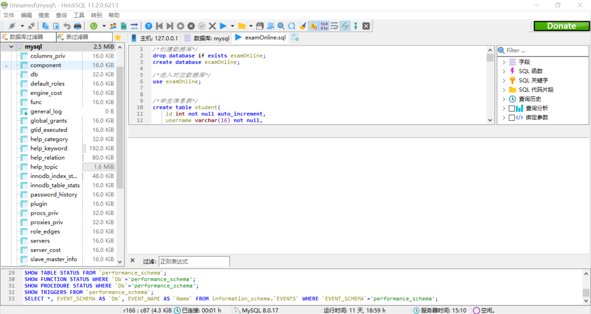
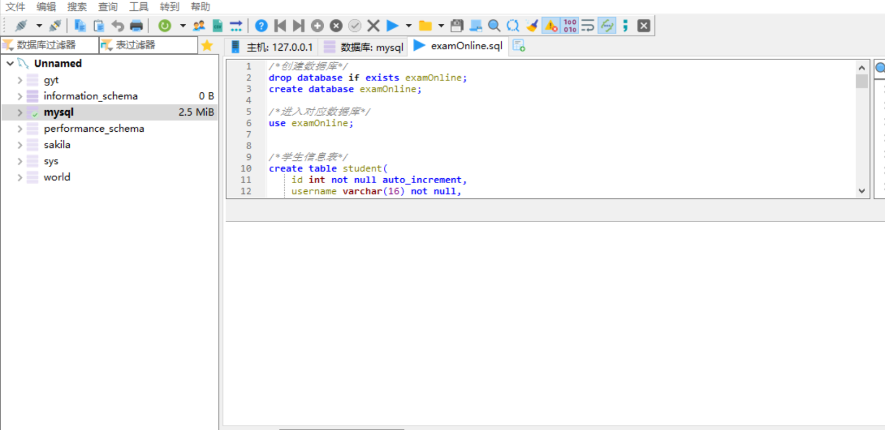

# 基本表     

/*创建数据库*/
drop database if exists examOnline; 
create database examOnline;

/*进入对应数据库*/
use examOnline;

/*学生信息表*/
create table student(
    id int not null auto_increment,
    username varchar(16) not null,
    pwd varchar(16) not null,
    name varchar(16) not null,
    sex varchar(4),
	studentclass  varchar(16) not null,
    telephone varchar(50),
    email varchar(100),
    ru int default 3,
    primary key(id)
);

/*教师信息表*/
create table teacher(
    id int not null auto_increment,
    username varchar(16) not null,
    pwd varchar(16) not null,
    name varchar(16) not null,
    sex varchar(4),
    telephone varchar(50),
    email varchar(100),
    ru int default 2,
    primary key(id)
);

/*管理员信息表*/
create table manager(
    id int not null auto_increment,
    username varchar(16) not null,
    pwd varchar(16) not null,
    name varchar(16) not null,
    sex varchar(4),
    telephone varchar(50),
    email varchar(100),
    ru int default 1,
    primary key(id)
);

/*选择题表*/
create table xzt(
    id int not null auto_increment,
    question varchar(1000) not null,
	answer varchar(4) not null,
	optionA varchar(100) not null,
	optionB varchar(100) not null,
	optionC varchar(100) ,
	optionD varchar(100) ,
	questiontype int default 1,
    questionpoint varchar(16),	
    primary key(id)
);

/*填空题表*/
create table tkt(
    id int not null auto_increment,
    question varchar(1000) not null,
	answer varchar(100) not null,
	questiontype int default 2,
    questionpoint varchar(16),	
    primary key(id)
);

/*编程题表*/
create table bct(
    id int not null auto_increment,
    question varchar(1000) not null,
	questiontype int default 3,
    questionpoint varchar(16),	
    primary key(id)
);

/*编程题答案表*/
create table bctanswer(
    id int not null auto_increment,
    username varchar(100) not null,
	papername varchar(16),
    answerpath1 varchar(100),
    answerpath2 varchar(100),
    primary key(id)
);

/*试卷表*/
create table paper(
    id int not null auto_increment,
    starttime datetime,
    endtime datetime,
    papername varchar(16) not null unique,
    xzt1 int not null,
    xzt2 int not null,
    xzt3 int not null,
    xzt4 int not null,
    xzt5 int not null,
    xzt6 int not null,
    xzt7 int not null,
    xzt8 int not null,
    xzt9 int not null,
    xzt10 int not null,
    tkt1 int not null,
    tkt2 int not null,
    tkt3 int not null,
    tkt4 int not null,
    tkt5 int not null,
    bct1 int not null,
    bct2 int not null,
    primary key(id)
);

/*学生成绩表*/
create table studentgrade(
    id int not null auto_increment,
    username varchar(16) not null,
	xztscore int default 0,
	tktscore int default 0,
	bctscore int ,
	papername varchar(16) not null,
    primary key(id)
);

/*错题表*/
create table mistakes(
    id int not null auto_increment,
    username varchar(100) not null,
    questiontype varchar(16),
	questionpoint int,
    primary key(id)
)；

/*添加外键约束*/
/*alter table 表名 add foreign key(qId) references QUESTIONS(id); 

/*备份数据库*/
/*mysqldump -u root -p123456 examonline-> C:\backup.sql*/

/*还原数据库*/
/*mysql -u root -p123456 < C:\backup.sql*/

/*开启MySQL的远程帐号-2）创建远程登陆用户并授权*/
/*如果想不限制链接的 IP 则设置为“%”即可。*/
/*grant all PRIVILEGES on 数据库名/数据表名 to root@'192.168.1.101'  identified by '123456';*/

##    视图

李金龙：修正考试页面,学生考试学生注册，学生成绩查询，学生成绩柱状图等，和管理员的增删教师。

高钰婷：教师的查询学生成绩，设计试卷，出卷，查看试卷功能等，

方鑫&张悦：合并学生页面的前后端。排除bug，完成成绩导出成excel功能，等等等等

李潇&梅显卉：协助合并前后端，排除upload方面的各种问题和取值方面的各种问题

李金龙：修正考试页面，将编程题与选择填空题界面分隔开

高钰婷：完成教师查看试卷界面

方鑫&张悦：修正注册页检查方法中的错误。合并学生页面的前后端。

李潇&梅显卉：写完了后台的教师出卷查卷的逻辑。

李金龙：完成教师添加题目界面

方鑫&张悦：修正上传路径的bug,封装了papertopaperstring 方法，批量上传了部分题目。

李金龙：完成部分教师出卷界面

高钰婷：完成部分教师批改试卷界面

李金龙：完成前端部分学生界面汇总及功能连接

方鑫&张悦：数据库增加了Bctanswer表，增加对应的javabean以及dao包和数据库操作。封装service层，完成对应的servlet。 

高钰婷：完成教师删除学生界面设计

李潇&梅显卉： 增加了教师出卷功能的dao层方法，和一部分servlet。

李金龙：完成学生错题界面

李金龙：完成学生自测页面

李金龙：完善试卷页面

高钰婷：完成教师查询学生成绩页面

李金龙：完成教师首页页面显示

高钰婷&李金龙：对教师模块各个界面进行设计

李金龙：完成管理员首页界面显示

高钰婷：完善之前页面效果

方鑫&张悦：把数据库studentgrade，score字段分为xztscore,tktscore,bctscore,其中bctscore默认值为-1，代表未批阅。同时修改对应的Javabean以及dao包下对应SQL语句。  

李潇&梅显卉：修复了mistakes类的问题，完成了错题集的填空题和编程题。

高钰婷：管理员管理教师页面

李金龙：完成主页页面设计和学生登陆后主页显示及并加入js效果。

方鑫&张悦：完成登陆页与注册页的js,修复部分bug。

方鑫&张悦：完成登陆页与后台的联系，ajax校验验证码。实现了各种上传文件.

李金龙：完成管理员发布公告静态页面和js部分效果

高钰婷：教师个人中心页面和管理员个人中心页面

高钰婷：完成前端考试查询页面，实现一个页面显示多个不同页面

李金龙：（数据丢失）解决前一天登陆注册问题

高钰婷：修改前台页面获取后台数据的脚本

方鑫&张悦：利用POI插件实现本地Excel批量上传题目到数据库题库。完成teacher类，管理员类的查看个人信息servlet方法。

李潇&梅显卉：实现了教师查看学生成绩；把所有的SQL语句修改封装到dao包；修改昨天遗留的错误。

李金龙：完成前端学生考试页面

高钰婷：完成前端学生考试成绩查询页面

方鑫&张悦&李潇&梅显卉：
1. 修改了bean包的缺陷
2. 完善了业务逻辑层和数据访问层之间的调用代码
3. 找到了生成试卷的新思路并写出了：大型构造函数及其封装类
4. 初步完成了学生端功能的（错题集、个人信息查询、个人成绩查询）servlet函数（自测尚未写出）
5. 前后端都实现了登陆注册验证码（红红火火恍恍惚惚）
6. 实现了一半的查看试卷功能
7. 实现了自测题的生成（不随机版）

李金龙：完成前端注册页面设计，并加入js验证功能。

方鑫&张悦：补全dao包的增删改查，具体实现。

李潇&梅显卉：封装好service层服务

高钰婷：完成前端学生个人信息界面设计

李金龙：完成前端登陆页面，并与后台进行测试

方鑫&张悦：修正昨天项目合并时的错误

李潇&梅显卉：教师类，学生类，管理员三个类 service包和dao包基础的增删改查

方鑫&张悦：其类的全部接口，以及实现2个类的实现，还缺4个类的实现。

方鑫&张悦：完成db层数据库的连接与关闭方法，连接到远程的MySQL服务器，
配置信息在"db.properties",暂时未实行数据库连接池，采用普通的方法。 

方鑫&张悦：修改bean层，增加注释以及构造方法，实现序列化接口。 

李潇&梅显卉： 完成项目说明文档。 

李潇&梅显卉： 添加bean层的九个Javabean实体类。 

方鑫&张悦： 新建项目，完成SQL语句建表，和说明文档。 

